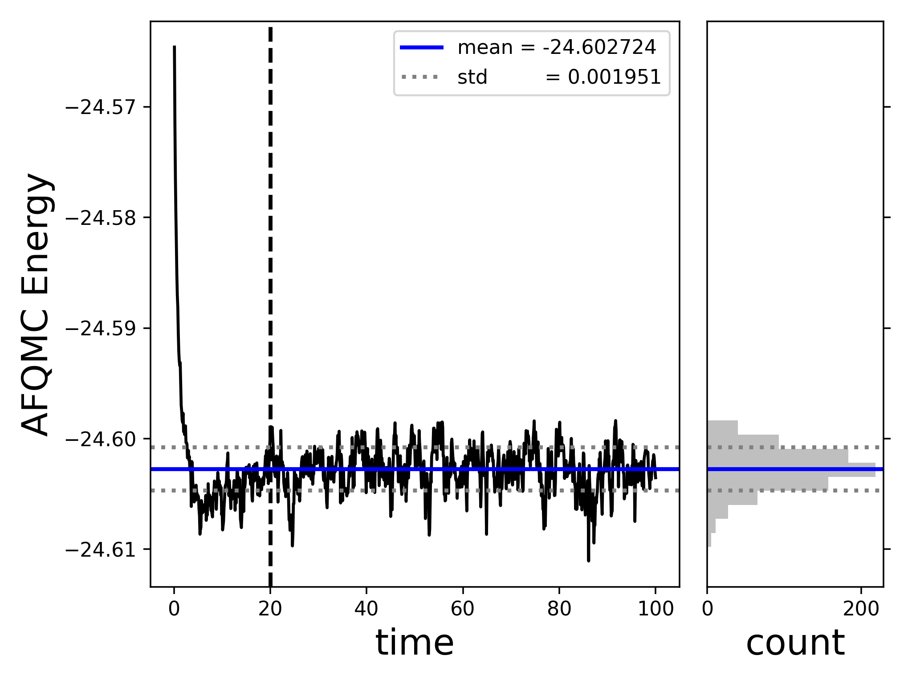

---
jupytext:
  text_representation:
    extension: .md
    format_name: myst
    format_version: 0.13
    jupytext_version: 1.19.1
kernelspec:
  display_name: Python 3
  name: python3
---

+++ {"id": "UwuNT7DqI_rN"}

# B atom – Semistochastic heatbath CI (SHCI) trial wavefunction

In this example, we will compute the ground state energy of the Boron (B) atom.
This is an open-shell atom with a single p-electron.
We used PySCF and `afqmctools` to generate a Hamiltonian and save it the SAFIRE HDF5 format (sample script at the end of this example); however, a FCIDUMP can be used instead.
If you already have a FCIDUMP, you can skip using the `afqmc_to_fcidump` tool,
and instead, after running SHCI, you can use the `fcidump_to_afqmc` tool to generate a Hamiltonian for SAFIRE.

References:

1. https://pubs.acs.org/doi/10.1021/acs.jctc.2c00802

## Example

Begin by generating a SAFIRE Hamiltonian HDF5 file.
See the [sample script below](#sample-script-for-generating-the-safire-hamiltonian-file).
afqmctools provides a command line tool to convert from the SAFIRE HDF5 Hamiltonian file to a FCIDUMP which can be read by many quantum chemistry codes.

```bash
afqmc_to_fcidump -i afqmc.h5 -o FCIDUMP
```

We will use SHCI as implemented in DICE for this example; 
the next step is generating an input file.
A full explanation of using Dice is beyond the scope of this example.
We refer the interested user to the official Dice GitHub page: https://github.com/sanshar/Dice.
For the sake of this example, we will simply provide an input file.
Copy and past the text below into a file within the example directory to use as an input file.
We called this input file `dice_input.dat`.

```txt
#system - B atom
nocc 5
  0 2 4 1 3
end
orbitals ./FCIDUMP
nroots 6

#variational
schedule
1   0.01
2   0.005
3   0.001
5   0.0005
10  0.0001
end
davidsonTol 5e-05
dE 1e-08
maxiter 20

#pt
nPTiter 500
epsilon2 1e-08
epsilon2Large 1000
targetError 0.00001
sampleN 300

#misc
printBestDeterminants 2000 # this is for the output file in ASCII
```

Now run Dice and be sure to save the text output to a file!
From the example directory,

```bash
/path/to/Dice/bin/Dice dice_input.dat &> output.dat
```

This will generate a fairly long output (due to printing 2000 Slater determinants per state in plain text), but you should see that the variational stage converges to something similar to:

```log
Variational calculation result
Root             Energy     Time(s)
   0      -24.6065937243       37.01
   1      -24.3848958840       37.01
   2      -24.2533868304       37.01
   3      -24.2463668768       37.01
   4      -24.1939152544       37.01
   5      -24.1830384836       37.01
```

The SHCI energy is given by the variational energy with perturbative corrections.
In this case, for the ground state, we got,

```log
**************************************************************
PERTURBATION THEORY STEP  
**************************************************************
Performing (semi)stochastic PT for state:   0
Deterministic PT calculation converged
PTEnergy:     -24.6065937243
Time(s):       38.52

2/ Stochastic calculation with epsilon2=1e-08
  Iter          EPTcurrent  State             EPTavg      Error     Time(s)
     1      -24.6066332993      0     -24.6066332993         --       38.72
     2      -24.6066530540      0     -24.6066431767         --       38.91
     3      -24.6066238689      0     -24.6066367408         --       39.13
     4      -24.6066484462      0     -24.6066396671         --       39.31
     5      -24.6066455360      0     -24.6066408409   5.36e-06       39.50
Semistochastic PT calculation converged
PTEnergy:     -24.6066408409 +/- 5.36e-06
Time(s):       39.50
```

Finally, `afqmctools` provides a command line tool to convert from the wavefunction printed in the Dice raw text output to the SAFIRE HDF5 wavefunction format.
From the example directory, run

```bash
$ dice_to_hdf5 -o shci_wfn.h5 -i output.dat -n 100 -v
Number of electrons: up:2, down:3
PHMSD trial wavfunction -> using uhf-like walkers
```

The `-o` option sets the output HDF5 file name,
`-i` sets the "input" to `dice_to_hdf5` (this will be an output from Dice!),
`-n` sets the number of Slater determinants to save (currently a required argument!),
and `-v` turns on verbose output.

Now, we need to write an SAFIRE input file.
You can set this up as you choose, here is a sample input file
for this case.

```json
{
  "afqmc": {
    "project": {
      "id": "qmc",
      "series": 0,
      "mixed_precision": false
    },
    "execute": {
      "walker_set": {
        "walker_type": "COLLINEAR"
      },
      "hamiltonian": {
        "filename": "afqmc.h5"
      },
      "wavefunction": {
        "filename": "shci_wfn.h5"
      },
      "timestep": 0.01,
      "steps": 10000,
      "n_walkers_per_mpi_task": 20,
      "measure_interval_multiplier": 1,
      "population_control_interval": 10,
      "walker_ortho_interval": 10,
      "seed": 42
    }
  }
}
```

Finally, we can run AFQMC using SAFIRE by running

```bash
$ mpirun -np 64 /path/to/SAFIRE/build/safire afqmc.json
```

When that has finished, we can use afqmctools to analyze the result,

```bash
$ scalar_stats qmc.s000.scalar.dat -s time -t -e 20.0 -t --savefig energy_vs_beta.png


====== [analyze_scalar_data Settings] ======

[+] fname            = qmc.s000.scalar.dat
[+] mark_header      = #               
[+] series_column    = time            
[+] nequil           = 20.0            
[+] estimate_equil   = False           
[+] column           = LocalEnergy     
[+] reblock          = 1               
[+] ndiscard         = None            
[+] list             = False           
[+] trace            = True            
[+] append           = None            
[+] dump             = False           
[+] dump_fname       = trace.dat       
[+] verbose          = True            
[+] autocorr         = None            
[+] savefig          = energy_vs_beta.png
[+] dump_avail_columns = False           

AFQMC Energy   -24.602724 +/-   0.000208 9.08 20.0/100.0
```

This will also generate the following plot within the `energy_vs_beta.png`. The plot will also open in a new interactive window if run locally.



+++

## Sample Script for Generating the SAFIRE Hamiltonian File

Simply run this python script to generate a SAFIRE Hamiltonian file for the B atom.

```{code-cell}
:id: OX7sSXv5U7KH

# sample script to generate a SAFIRE HDF5 Hamiltonian
#  using afqmctools and PySCF.
from pyscf import gto, scf

from afqmctools.utils.pyscf_utils import load_from_pyscf_chk_mol
from afqmctools.hamiltonian.mol import write_hamil_mol


### Step 1. Run PySCF to generate a basis
mol = gto.M(
    basis = "augccpvtz", # as in https://pubs.acs.org/doi/10.1021/acs.jctc.2c00802
    atom = "B 0. 0. 0.",
    spin = 1  # Nup - Ndown
)

atom_chkfile = "B.chk"


mf = scf.ROHF(mol).newton()
mf.chkfile = atom_chkfile
mf.kernel()

# perform stability analysis - see PySCF example:
# https://github.com/pyscf/pyscf.github.io/blob/master/examples/scf/17-stability.py
mo1 = mf.stability()[0]
dm1 = mf.make_rdm1(mo1, mf.mo_occ)
mf = mf.run(dm1)
mf.stability()
mf.kernel()

### Step 2. use afqmctools to generate and save the Hamiltonian.
# load data from PySCF checkpoint file
basis_scf_data = load_from_pyscf_chk_mol(
    chkfile = atom_chkfile
)

# write Hamiltonian
write_hamil_mol(
    basis_scf_data,
    hamil_file = "afqmc.h5",
    chol_cut = 1e-6,
    verbose=True
)
```
