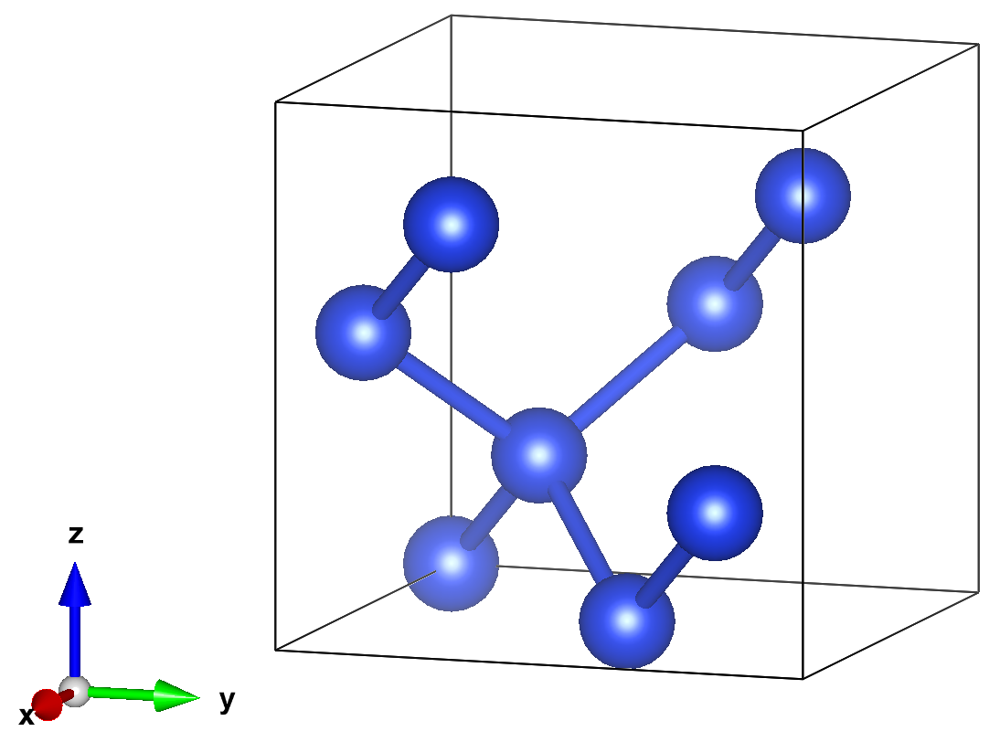
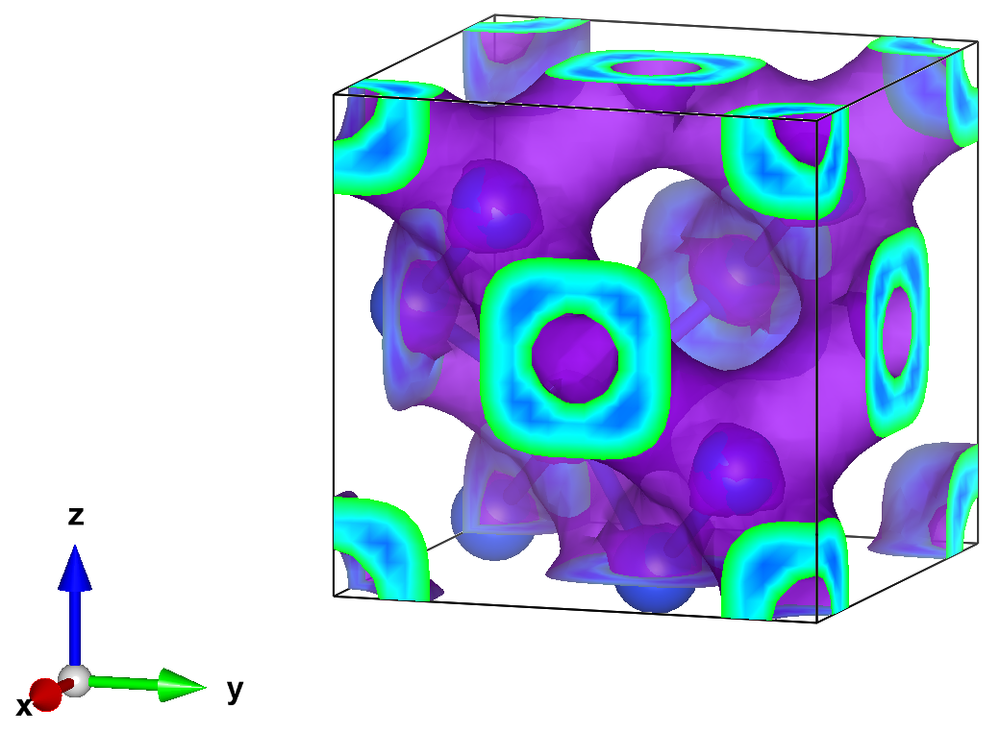

---
jupytext:
  text_representation:
    extension: .md
    format_name: myst
    format_version: 0.13
    jupytext_version: 1.19.1
kernelspec:
  display_name: Python 3 (ipykernel)
  language: ipython3
  name: python3
---

+++ {"id": "NudwCmJzZWxz"}

# Magnetization of ???

In this example, we will compute the magnetization of ???

DEV TODO:
- Choose the solid to compute the magnetization of.
- Replace image with solid ???.
- Update QE, Coqui, and SAFIRE sections with the new content.

STATUS: Kyle is assigned the example content.

+++ {"id": "3XqxpjD8Q5dA"}



+++ {"id": "wqDpVPxzZT62"}

## External Software

In addition to SAFIRE and afqmctools, we will be using the following software packages:

- [Quantum Espresso (QE)](https://www.quantum-espresso.org/) for density functional theory (DFT) calculations, and some integrals via its post-processing utilities
-  [CoQuí](https://github.com/mmorale3/BeyondDFT) for generating the SAFIRE Hamiltonian and Trial wavefunction HDF5 files from the output of QE.

+++ {"id": "TGWpFn73aPAi"}

## Setup

First, we need an orthonormal basis to express the second quantized Hamiltonian in.
We will run Quantum Espresso (QE) to generate a set of Kohn-Sham orbitals to use as a basis.
We assume knowledge of the basic use of QE in this example, but we'll point out a few details that are relevant to the workflow here.
All input files are provided in `1_dft_quantum_espresso`.

We will perform the following calculations with QE:

1. self-consistent DFT with a large k-point grid, but a minimal number of bands
2. a one-shot DFT calculation starting from the converged result in step 1., but at the $\Gamma$-point and using a large number of bands.
3. run post-processing utilities to generate data that we will need later. Specifically,
    - run pp.x to generate `VLOT` and `VSC` which are potentials that will be read later by CoQuí
    - run pw2bgw.x to generate `VKB` which will also be read by Coquí later

<div class="alert alert-block alert-info">
  <b>Note:</b> CoQuí expects to find all of `VLOT`, `VSC`, and `VKB` in the same QE output directory. Double check that the output paths of the post-processing tools are all set to the same directory.
</div>

### Step 1 : self-consistent DFT

To generate the Hamiltonian for SAFIRE, we need
to set `force_symmorphic=.true.` in the `&system` input card.
Run self-consistent DFT with the provided input file and pseudopotential.

```bash
$ pw.x -inp scf.inp > scf.out
```

where we have redirected output to scf.out.
You should see a final energy of,

```
 highest occupied, lowest unoccupied level (ev):     6.3054    7.0035

!    total energy              =     -62.96095502 Ry
     estimated scf accuracy    <       0.00000058 Ry

     The total energy is the sum of the following terms:
     one-electron contribution =      19.02415456 Ry
     hartree contribution      =       4.49885911 Ry
     xc contribution           =     -19.30056639 Ry
     ewald contribution        =     -67.18340230 Ry
```

### Step 2 : One-shot DFT

The goal here is generate the orbitals we need to generate the second
quantized Hamiltonian for AFQMC.
**In general, AFQMC needs to be converged in the number of bands included in the basis**.
Coquí will allow us to select a subset of bands.
One possible strategy at this point is to include a relatively large number of bands here and we use Coquí to write a subset of them.
This avoids re-running the one-shot DFT calculation at the cost of saving more data.

**Run the one-shot QE calculation.**

```bash
$ pw.x -inp nscf.inp > nscf.out
```

You should see something like the following,

```bash
Band Structure Calculation
     Davidson diagonalization with overlap

     Computing kpt #:     1  of     1
     total cpu time spent up to now is        0.4 secs

     ethr =  3.12E-09,  avg # of iterations = 49.0

     total cpu time spent up to now is        0.4 secs

     End of band structure calculation

          k = 0.0000 0.0000 0.0000 (  1189 PWs)   bands (ev):

    -5.6912  -1.5401  -1.5401  -1.5401  -1.5398  -1.5398  -1.5398   3.4173
     3.4173   3.4173   3.4174   3.4174   3.4174   6.3051   6.3051   6.3051
     7.0045   7.0045   7.0046   7.0047

     occupation numbers
     1.0000   1.0000   1.0000   1.0000   1.0000   1.0000   1.0000   1.0000
     1.0000   1.0000   1.0000   1.0000   1.0000   1.0000   1.0000   1.0000
     0.0000   0.0000   0.0000   0.0000

     highest occupied, lowest unoccupied level (ev):     6.3051    7.0045

     Writing all to output data dir OUT/pwscf.save/
```

**Note the location of the output data**; we will use the orbitals saved there when we compute the real-space charge density.

+++ {"id": "_uliHCdtig7m"}

### Step 3: QE post-processing utilities

CoQuí reads some of the details of the pseudopotential from QE.
We need to dump the relevant data to a file using the QE post-processing utilities.
See the provided input files for more.

Run the following.

```bash
$ pp.x < pp_vsc.inp > pp_vsc.out
$ pp.x < pp_vltot.inp > pp_vltot.out
$ pw2bgw.x < pw2bgw.inp > pw2bgw.out
```

If everything worked, you should see the following files in the "OUT" directory
that should have been generated by QE.

```bash
# running from the 1_dft_quantum_espresso directory
$ ls OUT
pwscf.save  pwscf.xml  VKB  VLTOT  VSC
```

**We're ready to move on to CoQuí.**

+++ {"id": "qELxzaWcjjlh"}

## Writing the 2nd-quantized Hamiltonian and Trial wavefunction

CoQuí is able to directly generate a Hamiltonian HDF5 file for SAFIRE using the data output by QE.
Additionally, it can write a trial wavefunction based on the DFT solution from QE.
**A sample CoQuí input file is provided**.

```toml
[mean_field.qe]
name     = "mf"
prefix   = "pwscf"
outdir   = "../1_dft_quantum_espresso/OUT"
nbnd     = 20

[interaction.cholesky]
name        = "eri"
mean_field  = "mf"
output      = "hamiltonian.h5"
write_type  = "single"
tol         = 1e-5

[hamiltonian]
mean_field  = "mf"
output      = "hamiltonian.h5"
add_wavefunction = "default"
```

The key details to note are:

- In `[mean_field.qe]`, we need to set the `outdir` to the directory where both the QE `pwscf.xml` file is saved, and where `VLTOT`, `VSC`, and `VKB` are.
- Also in `[mean_field.qe]`, we can set the number of bands to use with `nbnd`. Of course, we can only use as many bands as we output in the one-shot DFT calculation previously.
- In the `interaction` input block, we are using the "cholesky" decomposed form for the interaction and have set a tolerance of `tol = 1e-5`. We have set the `output` to a file called "hamiltonian.h5` to tell CoQuí to save the interaction there.
- The `hamiltonian` block is used to write the one-body part of the Hamiltonian to HDF5. **We need to set this to the same file as the interaction.**
- Finally, we can save a single Slater determinant wavefunction to the Hamiltonian setting the `add_wavefunction = "default"` parameter in the `hamiltonian` block. The Slater determinant is constructed by occupying the Kohn-Sham orbitals with the largest occupancy.

Now, run Coquí.

```bash
$ /path/to/coqui --verbosity=2 --filenames hamil.toml &> hamil.out
```

You should see the following output in `hamil.out`.

```
 ---------------------------------
     ____ ___   ___  _   _ ___
    / ___/ _ \ / _ \| | | |_ _|
   | |  | | | | | | | | | || |
   | |__| |_| | |_| | |_| || |
    \____\___/ \__\_\\___/|___|
  --------------------------------
 |  Correlated Quantum Interface  |
  --------------------------------

Input Parameters
----------------

[mean_field.qe]
name = 'mf'
nbnd = 20
outdir = '../1_dft_quantum_espresso/OUT'
prefix = 'pwscf'

[interaction.cholesky]
mean_field = 'mf'
name = 'eri'
output = 'hamiltonian.h5'
tol = 1.0000000000000001e-05
write_type = 'single'

[hamiltonian]
add_wavefunction = 'default'
mean_field = 'mf'
output = 'hamiltonian.h5'

-- End of Input Parameters --

BZ symm info:  
  - Number of Qpts in IBZ: 1
  - Number of symmetries used with Qpts: 1
  - Number of time reversal kpoint pairs: 0

 Generating truncated G-space grid:
   - size: 1189

  Quantum ESPRESSO reader
  -----------------------
    - nspin: 1
    - npol: 1
    - nbnd: 20
    - Monkhorst-Pack mesh = (1,1,1)
    - nkpts: 1
    - nkpts_ibz: 1
    - nelec: 32.0
    - ecutrho: 32.0 a.u.
    - fft mesh: (27,27,27)
    - wfc ecut: 7.8710084309817 a.u.
    - wfc ngm: 1189
    - wfc fft mesh: (13,13,13)


 Generating truncated G-space grid:
   - size: 9315

*******************************************
 Electron-electron interaction:
*******************************************
 - type: coulomb
 - ndim: 3
 - cutoff:1e-08
 - screen_type:none

*******************************
 ERI::cholesky:
*******************************
  -pw cutoff (Ha): 32.0
  -size of PW basis: 9315
  -cholesky truncation: 1e-05
  -number of k-point pools: 1
  -number of processors per pools: 64
  -default block size: 32


  iq:0  nchol:153
Writing distributed Vq at iq = 0 to .//hamiltonian.h5
*******************************
 Cholesky ERI Reader:
*******************************
    - Np max  = 153
    - accuracy = 1e-05
    - read mode = each_q
    - eri storage: outcore
    - ERI dir = ./
    - ERI output = hamiltonian.h5

*******************************
 Second-quantized 1-Body Hamiltonian  
*******************************
output: hamiltonian.h5
format: qmc
type: bare
add_wfn: default
************************************************
 Initializing External Potential:
************************************************
  input type: qe::pp/qe::pw2bgw
  type: NCPP
  # of species: 1
  # of atoms: 8
  max # of projectors per atom: 8
  # of projectors: 64

 Memory usage:
   Overlaps:                      1.9073486328125e-05 MB
   Dion:                          9.5367431640625e-07 MB
************************************************

*******************************************
 Electron-electron interaction:
*******************************************
 - type: coulomb
 - ndim: 3
 - cutoff:1e-08
 - screen_type:none

*************************************************
               Adding  Wavefunction              
*************************************************
 Adding default wavefunction (assuming MO basis)
 Total number of electrons in waveunction: nup:16, ndown:16:
 Number of occupied states per kpoint:
 ik:0 nocc:16
*************************************************
```

The HDF5 file, "hamiltonian.h5", that CoQuí just generated can be
directly read in SAFIRE to get the Hamiltonian and the trial wavefunction.

+++ {"id": "-QQPlGsMnzeJ"}

## Run AFQMC

Next, we'll run SAFIRE using the Hamiltonian and trial wavefunction that we wrote using CoQuí.
We've provided an input file in `3_afqmc` for this example.
To learn more about the input file, see {doc}`../../../tutorials/solids/02_understanding_the_input_file/02_understanding_the_input_file`.

The input file assumes that you ran CoQuí within the `2_hamiltonian_coqui` directory.
If you ran it elsewhere, you will need to update the path to the HDF5 file
in `wavefunction` accordingly

A key part of the input file is the "estimator" block for the
back-propagation algorithm.

```json
"estimator": {
    "name":"back_propagation",
    "path_restoration":true,
    "extra_path_restoration":true,
    "ortho":10,
    "nsteps":400,
    "naverages" : 2,
    "equil":400,
    "onerdm" : {
        "name":"onerdm"
    }
},
```

The "name" parameter tells SAFIRE what kind of estimator to use (`"back_propagation"` in this case).
The "nsteps" parameter determines the number of back propagation steps to use.

To check for convergence in the number of back propagation steps, SAFIRE allows multiple "averages" to be set up which each use a different number of steps.
This feature is controlled by setting `"naverages"` to a value greater than one.
The number of steps that will be used in each average is given by,

$$
N^{step}_a = \frac{nsteps}{naverages - a},
$$

where $a$ is the 0-based index of the "average", and "nsteps" and "naverages" are corresponding values from the input file.
So, for the example here,

$$
N^{step}_0= 200
$$

and

$$
N^{step}_1 = 400
$$.

Now we can run SAFIRE using this input file.
We provided a sample Slurm script.
In practice, the slurm details will depend on your specific cluster.

```bash
#!/bin/bash -l
#SBATCH -J afqmc
#! Number of MPI ranks (= tasks for Slurm)
#SBATCH --ntasks=192
#SBATCH --time=2:00:00

# set up your enviornment as needed here
#
# source /path/to/env.sh

# Launch MPI code...
date
srun --cpu-bind=cores /path/to/safire afqmc.json &> afqmc.out
date
```

Or, you can run locally with,

```bash
$ mpirun -np [number of processes] /path/to/safire afqmc.json &> afqmc.out &
```

where `[number of processes]` depends on how many tasks can be run on your local machine.

We've included some of the output below.
You should see similar numbers in your output.

```
****************************************************
               Initializing Hamiltonian

****************************************************

 Hamiltonian Factory input:
system: sysid_2
filename: ../2_hamiltonian_coqui/hamiltonian.h5
name: hamiltonian_unique_id_5

 Initializing Hamiltonian from file: ../2_hamiltonian_coqui/hamiltonian.h5
 Found hamiltonian with format: coqui

 - Nuclear coulomb energy: (0.000000, 0.000000)
 - Frozen Core energy: (0.000000, 0.000000)
 - Electron self-interaction energy: (-8.846596, 0.000000)

KPFactorizedHamiltonian input:
name: hamiltonian_unique_id_5
filename: ../2_hamiltonian_coqui/hamiltonian.h5
batched: false
out_of_core: false
cutoff_cholesky: 9.9999999999999995e-07
memory: 4096
nsampleQ: -1


****************************************************
               Initializing Wavefunction

****************************************************
 Wavefunction type: NOMSD
 - Number of determinants in trial wavefunction: 1
 - Coefficient of first determinant: (1.000000, 0.000000)
 getHamOps from scratch
 nkpts: 1

NOMSD input:
nbatch: 0
number_of_references: -1
rediag: false


****************************************************
               Initializing Propagator

****************************************************

BasePropagator input:

nbatch: 0
nbatch_qr: 0
i: -1
a: -1
vbias_bound: 50
external_field_scale: 1
upper_cutoff_scale: 10
lower_cutoff_scale: 1
apply_constrain: true
importance_sampling: true
substractMF: true
hybrid: true
printP1eigval: false
free_projection: false
denseP1: false
external_field:
excited:
debug_verbosity: false


 --------------- Constructing Propagator ------------------

 Using sequential propagation.
 vbias_bound: 50
 Using sparse 1-body propagator
 Using hybrid method to calculate the weights during the propagation.
 Local Energy of starting determinant
  - Total energy    : (-1.191595, 0.000000)
  - One-body energy : (0.800315, 0.000000)
  - Coulomb energy  : (2.632165, 0.000000)
  - Exchange energy : (-4.624075, 0.000000)

```

When SAFIRE has finished running, you should see the `qmc.s000.scalar.dat`, and `qmc.s000.stat.h5` output data files.

```
$ ls 3_afqmc
afqmc.json  afqmc.out  qmc.s000.scalar.dat  qmc.s000.stat.h5
```

+++ {"id": "KLWinWxMscWQ"}

## Analyze

### Ground state energy

`afqmctools` includes a command line tool for analyzing the scalar data output.
Fun the following command.
If you are running locally, the `-t` option will cause a plot of the scalar data samples versus total projection time to be generated as seen below.
If you are running remotely, you can add the `--savefig [filename].png` option to save the figure.
Note, you must still use `-t` to generate the plot.

```{code-cell} ipython3
:id: pmR1rRGJAenu

!scalar_stats 3_afqmc/qmc.s000.scalar.dat -s time -t -e 5.0 --savefig 3_afqmc/energy_vs_beta.png
```

+++ {"id": "tq9vNkeZDhw2"}

Your plot should look similar to the following.

+++ {"id": "NYRwlRYYEh79"}

### Charge Density

`afqmctools` provides a function for generating the real-space charge density
given the one-body reduced density matrix (1rdm), and its stochastic uncertainty from AFQMC, as well as the orbitals from Quantum Espresso.
It will output the resulting 1rdm in a standard *.cube file.
The *.cube file can then be opened in one of several
software packages.

The provided script `analysis.py` demonstrates how to call the `charge_density()` function.

```{code-cell} ipython3
from pathlib import Path

from afqmctools.analysis.rdm import average_afqmc_rdm
from afqmctools.observables.rhonk import charge_density

qe_output = Path("./1_dft_quantum_espresso/OUT")
afqmc_path = Path("./3_afqmc")

mean_rdms,err_rdms = average_afqmc_rdm(rdm_file=afqmc_path / "qmc.s000.stat.h5")

num_avgs = mean_rdms.shape[0]
for i in range(num_avgs):
    charge_density(
        mean_rdms[i],
        err_rdms[i],
        orbital_source=qe_output,
        rho_outfile=f"rho_avg{i}_qe_orbs.cube"
    )
```

+++ {"id": "UPJFQtt0FlF-"}

Finally, we can open the charge density for visualization.
Here we used Vesta to make the following isosurface plot (using an isosurface value of 0.0023)

+++ {"id": "zeBur8RnsewA"}


