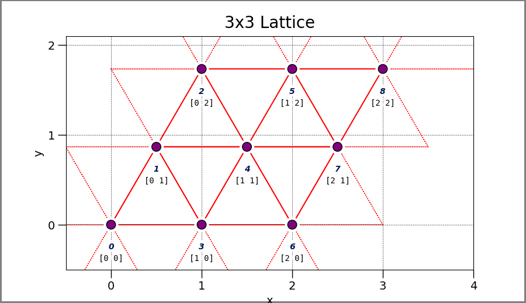

.. _setup_ex_8:

Triangular Hubbard Model
^^^^^^^^^^^^^^^^^^^^^^^^

This example covers building a Hubbard model Hamiltonian on a triangular lattice, 
and generating a free-electron trial wavefunction.

A lattice model Hamiltonian can be generated using afqmctools and
a toml-based input file.
Below is a sample input file, which we name `input.toml`

.. literalinclude:: input.toml

if no "type" is specified in the "lattice" section, then a square lattice is used.

afqmctools can be invoked within a Python script as

.. code-block:: python

    from afqmctools.hamiltonian.model.builder import HamiltonianBuilder
    import afqmctools.utils.io as io
    from afqmctools.wavefunction.free_electron import free_electron
    import afqmctools.utils.visualize as vis

    infile = "input.toml"

    # Build and save a lattice model Hamiltonian
    hamiltonian_builder = HamiltonianBuilder.from_input(source=infile)
    lattice = hamiltonian_builder.lattice
    hamiltonian = hamiltonian_builder.hamiltonian

    # makes a visualization of the lattice and saves it "lattice.png"
    vis.plot_lattice(
        lattice=lattice,
        save=True
    )

    nelec = io.read_input_params(infile)["misc_params"]["nelec"]
    io.write_model_hamiltion(
        hamiltonian=hamiltonian,
        fname="afqmc.h5",
        nelec=nelec
    )

    # compute and save a free-electron trial wfn
    free_electron(
        source=infile,
        nelec=nelec,
        output="afqmc.h5"
    )

The `free_electron()` function accepts a `twist` keyword argument for the sake of 
reproducibility for open-shell systems. 
`twist` should be a 2-d iterable containing :math:`\vec{\theta}=(\theta_1,\theta_2)`
in radians even if one component is set to 0.0.
By default, a small incommensurate twist angle is used.

If the sample Python script is run above with the sample input file, the following
should be present at the end of the output.

.. code-block:: text

    Running in Slater Detemrinant Mode
    energyCall: Etotal=(-10.449536323547363+0j) with EK=(-12.000000953674316+0j) EU=(1.5504649877548218+0j) EU1=0 EU2=0 EJ=0
    Reference HF Energy = -10.449536323547363

See the examples in :ref:`run_afqmc_exs` for how to run AFQMC.
