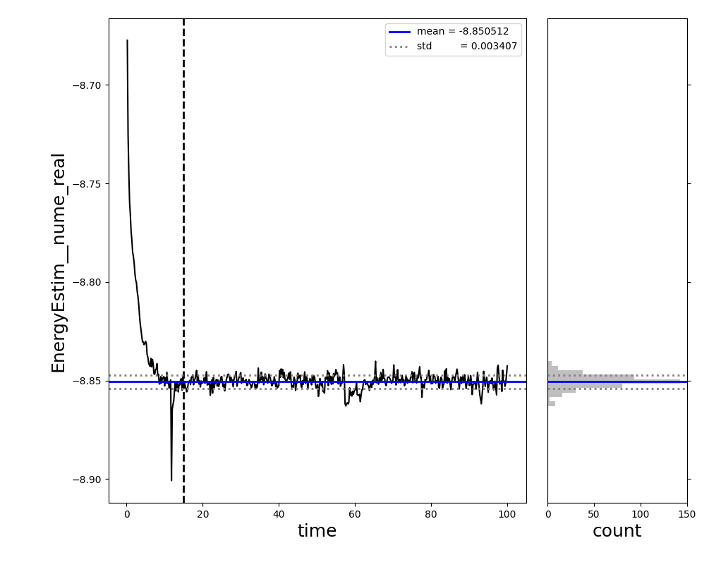

.. _analysis_ex_1:

Analyzing Scalar Data
^^^^^^^^^^^^^^^^^^^^^
This example covers analyzing the scalar stochastic data output by SAFIRE.

This example assumes that you have already run an AFQMC calculation using
using SAFIRE.
If not, see :ref:`run_afqmc_exs` for examples on running it.
While the AFQMC executable runs, it prints scalar data samples to a text-based file.
The name of the file depends on the parameters set in the "project" block of 
the AFQMC input file and follows the pattern, "[id].s[###].scalar.dat" where "[id]" is replaced by the "id" string and "[###]" is replaced by the value of "series" but at a fixed width of 3.

For example, using the sample "project" block here,

.. code-block:: json

    "project": {
      "id": "qmc",
      "series": 0
    }

the data will be written to a file called, "qmc.s000.scalar.dat".
We assume this name for the remainder of the example.

The scalar data file is organized as a series of columns, corresponding to scalar data, 
and rows, corresponding to samples to taken at each measurement.
There are many columns inlcuded in the scalar datafile.
A typical user will usually be most interested in the following columns.

* "time" gives the total projection time, in units of inverse energy, at which the current sample was taken.
* "EnergyEstim__nume_real" is the energy sample.
* "weight" gives the total walker weight. This can be useful for troubleshooting.
* "LogOvlpFactor" gives the log of the overlap of the trial wavefunction and the stochastic representation of the many-body wavefunction.

The "afqmctools" Python package includes functions to assist in analyzing the scalar data.
The following sample Python script can be used to compute the average AFQMC energy and stochastic
uncertainty.

.. code-block:: python

    from stats.scalar_dat import analyze_scalar_data

    analysis_settings = dict(
        fname = "qmc.s000.scalar.dat",
        xaxis = "time",
        nequil = 5.0,      # length of equilibration phase in units of imaginary time (not steps!)
        trace = True       #   plots a trace of the scalar data
    )

    E,dE = analyze_scalar_data(analysis_settings)

Running the script above based on the scalar data file generated by running 
SAFIRE as in the example :ref:`run_afqmc_ex_1` and using inputs from setup example :ref:`setup_ex_1`  will generate the following the following text-based output:

.. code-block:: text

    EnergyEstim__nume_real  -8.850512 +/-   0.000434 6.91 15.0/100.0

and the following plot

where the left panel shows the scalar data vs total imaginary projection time,
and the right panel shows a histogram of the stochastic samples of the scalar data.
The vertical dotted line in the left panel illustrates the end of the equilibration phase, 
as specified by the "nequil" setting passed to "analyze_scalar_data" via the 
"analysis_settings" dictionary.
This plot should be visually inspected to check that the AFQMC energy has equilbrated
by the end of the equilibration phase, and that the histogram resembles a normal distribution.

Any other scalar data column can be analyzed Similarly by setting "column" to the desired value
within "analysis_settings" as show below:

.. code-block:: python

    from stats.scalar_dat import analyze_scalar_data

    analysis_settings = dict(
        fname = "qmc.s000.scalar.dat",
        xaxis = "time",
        nequil = 5.0,       # length of equilibration phase in units of imaginary time (not steps!)
        trace = True,       #   plots a trace of the scalar data
        column = "weight"   # set the desired column to analze. default is "EnergyEstim__nume_real"
    )

    weight,delta_weight = analyze_scalar_data(analysis_settings)
